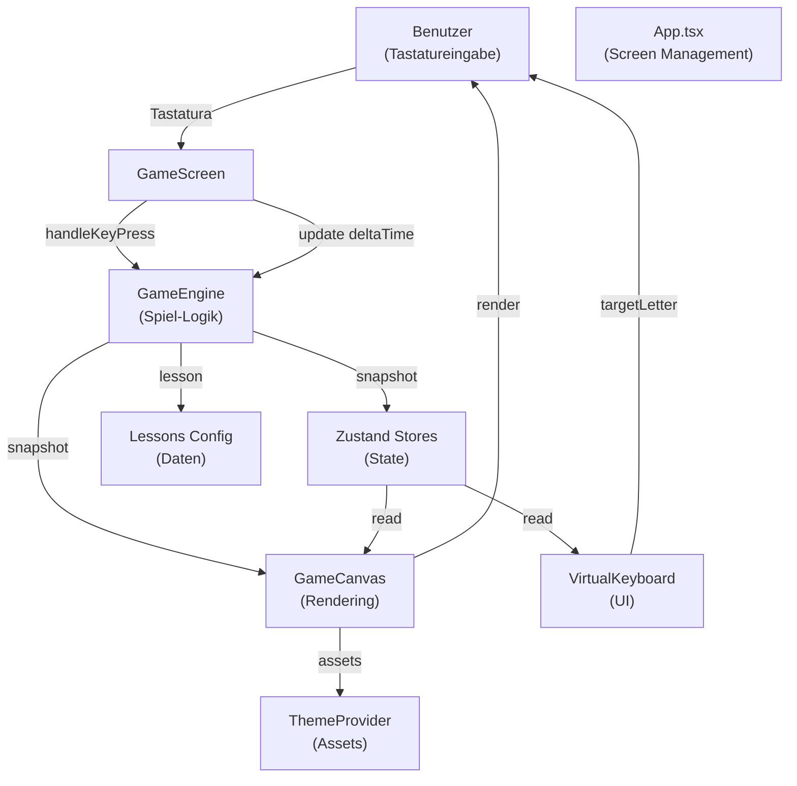
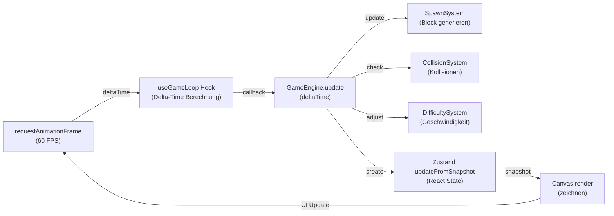
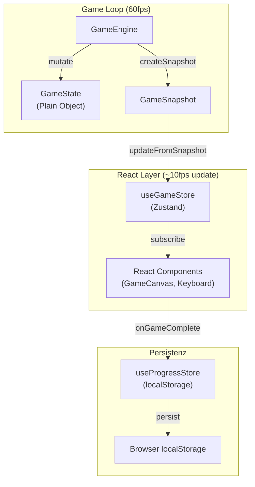
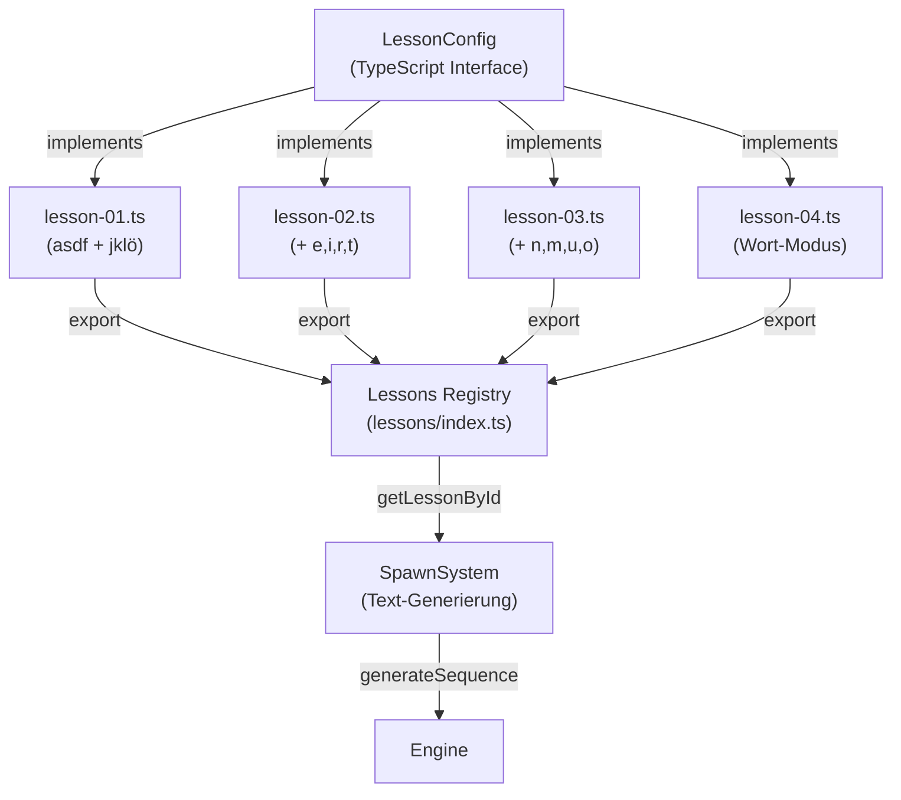
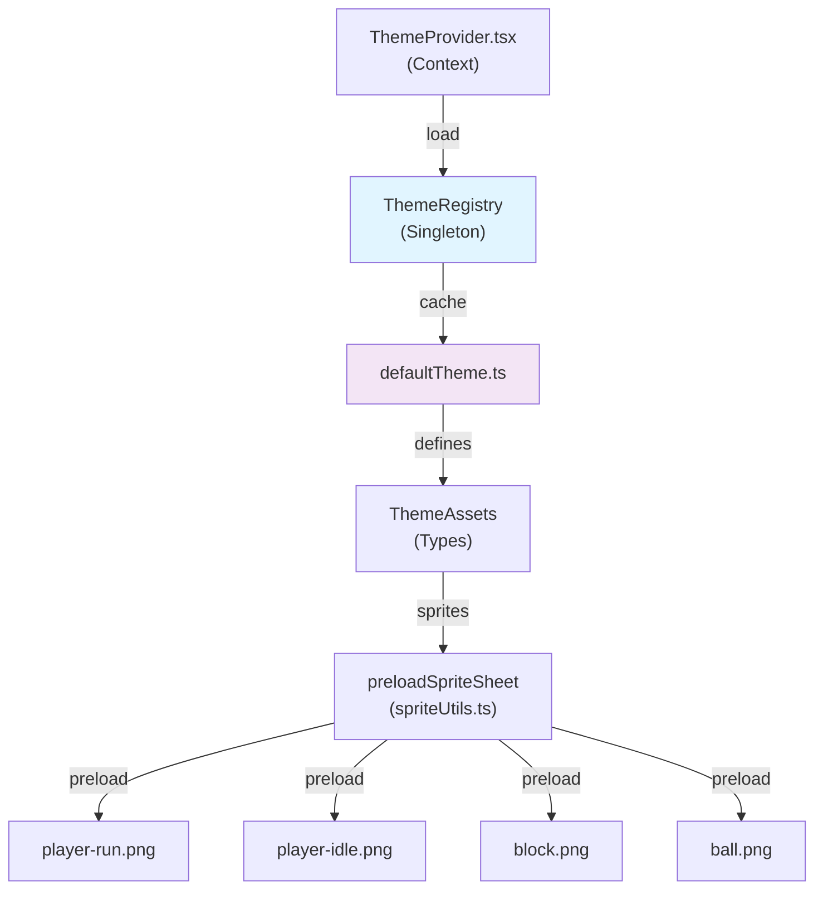
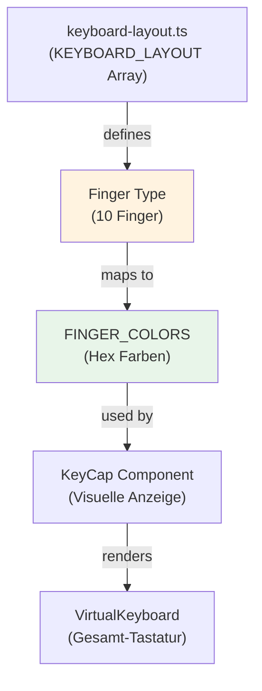
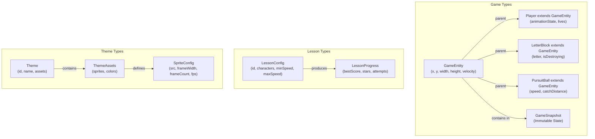

# Architektur: 10-Finger-Schreibtrainer

## 1. Hochlevel-Übersicht

Der Schreibtrainer ist eine React-basierte Webanwendung mit einer game engine separat von der UI-Logic.



## 2. Komponenten-Hierarchie

```
App
├── MenuScreen (Start-Menü)
├── LessonSelectScreen (Lektionen-Übersicht)
├── GameScreen (Haupt-Spielbildschirm)
│   ├── GameCanvas (Canvas mit Game-Engine)
│   ├── VirtualKeyboard (Tastatur-Anzeige)
│   └── Game-Over Modal
└── ThemeProvider (Context für Assets)
```

## 3. Game Loop Architektur



**Wichtig:** Die Game-Engine läuft mit ~60fps in einem lokalen Update-Zyklus. Der Zustand wird nur ~5-10 mal pro Sekunde aktualisiert, damit React nicht zu oft re-rendert.

## 4. State Management Pattern



## 5. Lesson & Character System



## 6. Theme-System (Plugin-Architektur)



**Erweiterung mit neuen Themes:**
- Neuer Ordner `public/themes/my-theme/`
- `theme.json` mit Asset-Pfaden
- `ThemeRegistry.register('my-theme', loader)` aufrufen
- Kein Code-Änderungen nötig!

## 7. Keyboard Layout & Fingerzuordnung



**10-Finger-Positions:**
```
Linke Hand:          Rechte Hand:
Pinky (Rot)          Index (Türkis)
Ring (Orange)        Middle (Blau-Grün)
Middle (Blau)        Ring (Grün)
Index (Lila)         Pinky (Orange-Rot)
```

## 8. Typescript Type Hierarchy



## 9. File Structure Overview

```
schreibtrainer/
├── public/
│   └── sprites/              # Placeholder - würde echte Assets haben
│       ├── player-run.png
│       ├── player-idle.png
│       ├── block.png
│       └── ball.png
│
├── src/
│   ├── types/                # TypeScript Interfaces (zentral)
│   │   ├── game.types.ts
│   │   ├── lesson.types.ts
│   │   ├── theme.types.ts
│   │   └── keyboard.types.ts
│   │
│   ├── engine/               # Game Logic (framework-unabhängig)
│   │   ├── GameEngine.ts     # Hauptlogik
│   │   ├── GameState.ts      # State-Klasse
│   │   └── systems/
│   │       ├── CollisionSystem.ts
│   │       ├── DifficultySystem.ts
│   │       └── SpawnSystem.ts
│   │
│   ├── config/               # Daten-Konfigurationen
│   │   ├── lessons/
│   │   │   ├── lesson-01.ts bis lesson-04.ts
│   │   │   └── index.ts
│   │   ├── keyboard-layout.ts
│   │   └── game-settings.ts
│   │
│   ├── store/                # State Management (Zustand)
│   │   ├── useGameStore.ts
│   │   ├── useProgressStore.ts
│   │   └── useLessonStore.ts
│   │
│   ├── hooks/                # React Hooks
│   │   ├── useGameLoop.ts
│   │   ├── useKeyboardInput.ts
│   │   └── useSpriteAnimation.ts
│   │
│   ├── components/
│   │   ├── screens/          # Ganze Seiten
│   │   │   ├── MenuScreen.tsx
│   │   │   ├── LessonSelectScreen.tsx
│   │   │   ├── GameScreen.tsx
│   │   │   └── ResultScreen.tsx
│   │   ├── game/            # Game-Rendering
│   │   │   └── GameCanvas.tsx
│   │   ├── keyboard/        # Tastatur-UI
│   │   │   ├── VirtualKeyboard.tsx
│   │   │   └── KeyCap.tsx
│   │   └── ui/              # Generic UI
│   │       └── Button.tsx
│   │
│   ├── themes/              # Theme System
│   │   ├── ThemeProvider.tsx
│   │   ├── ThemeRegistry.ts
│   │   └── defaultTheme.ts
│   │
│   ├── utils/               # Hilfsfunktionen
│   │   ├── textGenerator.ts
│   │   ├── audioManager.ts
│   │   └── spriteUtils.ts
│   │
│   ├── App.tsx              # Haupt-App Component
│   └── main.tsx             # React Entry Point
│
├── tests/                   # Unit & Component Tests
│   ├── engine/
│   ├── components/
│   ├── hooks/
│   └── store/
│
├── vite.config.ts
├── vitest.config.ts
├── tsconfig.json
├── package.json
├── arch.md                  # Diese Datei
└── srs.md                   # Anforderungen
```

## 10. Datenfluss: Ein kompletter Spielzug

```
1. Benutzer drückt Taste 'f'
   ↓
2. useKeyboardInput Hook fängt 'keydown' Event
   ↓
3. GameEngine.handleKeyPress('f') aufgerufen
   ↓
4. Engine prüft: Ist 'f' == targetLetter?
   ├─ JA:
   │  ├─ LetterBlock.isDestroying = true
   │  ├─ score += 10
   │  ├─ difficultySystem.recordCorrectInput()
   │  └─ selectNextTarget()
   │
   └─ NEIN:
      └─ difficultySystem.recordWrongInput()
   ↓
5. GameEngine.update(deltaTime) im nächsten RAF-Frame
   ├─ Blöcke bewegen sich nach links
   ├─ Ball bewegt sich nach rechts
   ├─ Kollisionsprüfung
   └─ SpawnSystem spawnt neue Blöcke
   ↓
6. Engine.getSnapshot() erstellt GameSnapshot
   ↓
7. useGameStore.updateFromSnapshot(snapshot)
   ├─ score aktualisiert
   ├─ targetLetter aktualisiert
   └─ React Components re-rendern
   ↓
8. GameCanvas rendert neue Frame
   └─ VirtualKeyboard hebt neue Zieltaste hervor
```

## 11. Erweiterungspunkte

### Neue Lektion hinzufügen
1. Neue Datei `src/config/lessons/lesson-05.ts` erstellen
2. `LessonConfig` Interface implementieren
3. In `lessons/index.ts` importieren und zu Array hinzufügen

### Neues Theme hinzufügen
1. Ordner `public/themes/my-theme/` anlegen
2. `theme.json` mit Assets definieren
3. `ThemeRegistry.register('my-theme', loader)` in `ThemeRegistry.ts`

### Neue Spielmechanik
1. Neue System-Klasse in `src/engine/systems/` erstellen
2. In `GameEngine.update()` aufrufen
3. Bei Bedarf neue Game Events in `GameSnapshot` hinzufügen

## 12. Performance-Optimierungen

- **Canvas vs. DOM:** Canvas für Game-Rendering, nicht React Components
- **Update Frequency:** Game Loop 60fps, Store Updates ~10fps
- **Delta-Time:** Framerate-unabhängige Physik
- **Max Delta Clamp:** Verhindert "Death Spiral" bei langsamen Geräten
- **Lazy Loading Themes:** Themes werden nur bei Auswahl geladen
- **localStorage Persistenz:** Zustand persist Middleware
